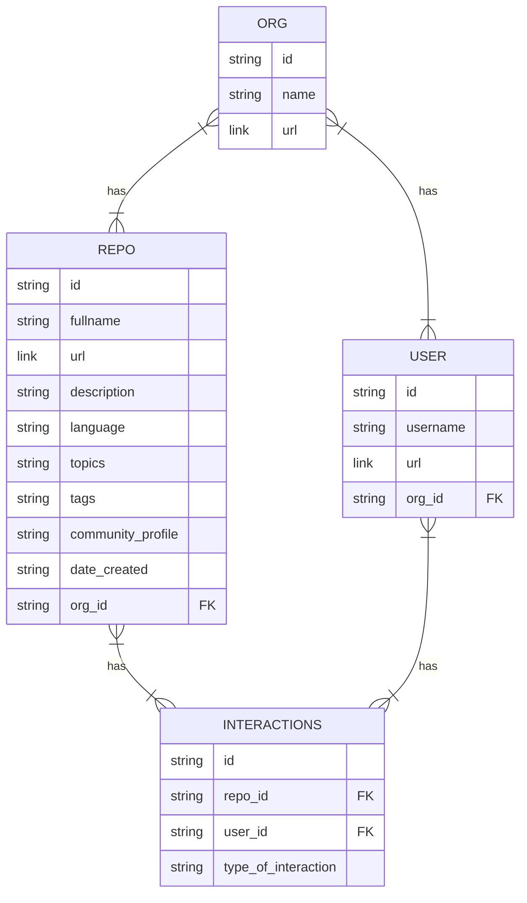

## Place to List Overview of Data Collection

1. Repositories
   - Languages
   - Topics
   - Tags
   - Community Profile
   - Description
   - Date Created/Modified
   - Organization
   
2. Users
   - Description
   - Rate of Activity
   - Organizations

3. Organizations
   - Description

4. Interactions
    - Forks (counting number of forks per repo and who has forked what)
    - Teams (counting number of teams per repo and who is on which team)
    - Contributors (counting number of contributors per repo and who has contributed what)
    - Starrers (counting number of starrers per repo and who has starred what)
    - Watchers (counting number of watchers per repo and who has watched what)
    - Followers/Following (counting number of followers per user and who is following who)
    - Issues (counting number of issues per repo and who has opened/closed what)
    - PRs (counting number of PRs per repo and who has opened/closed what)

### Entity Relationship Diagram of the Data Collection

### File Naming Conventions

Three central files:
1. `repos_data_table.csv`
2. `users_data_table.csv`
3. `orgs_data_table.csv`

These contain all unique list of repos and users identified, and also any expanded metadata for those entities.

Other files:
1. `forks_data_table.csv`
2. 